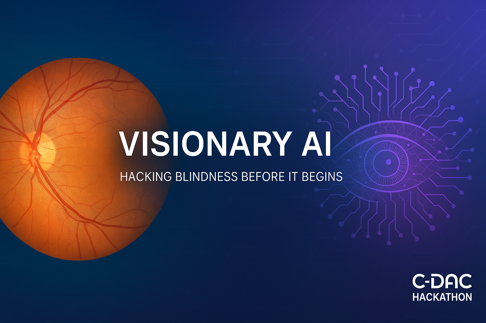
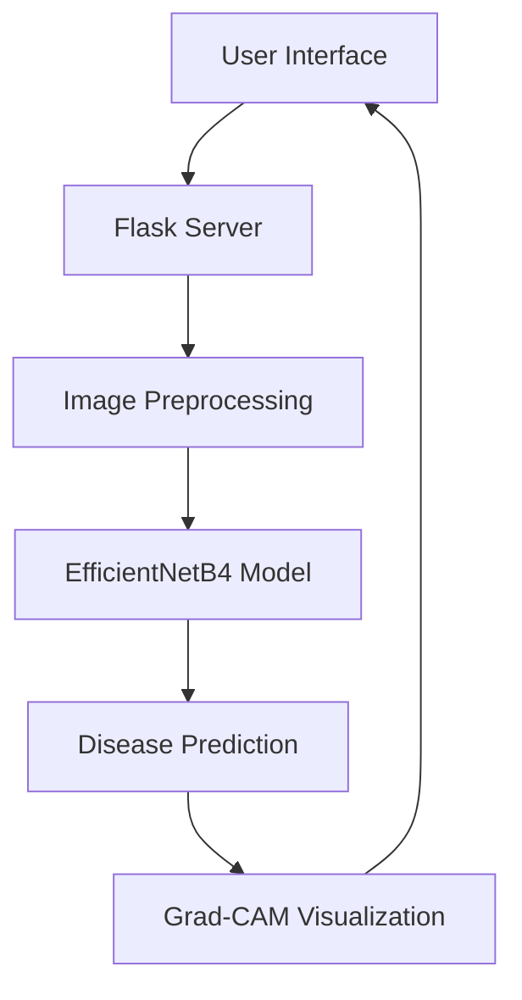
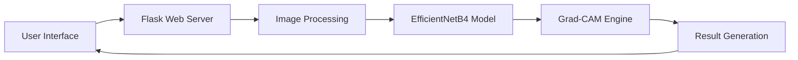
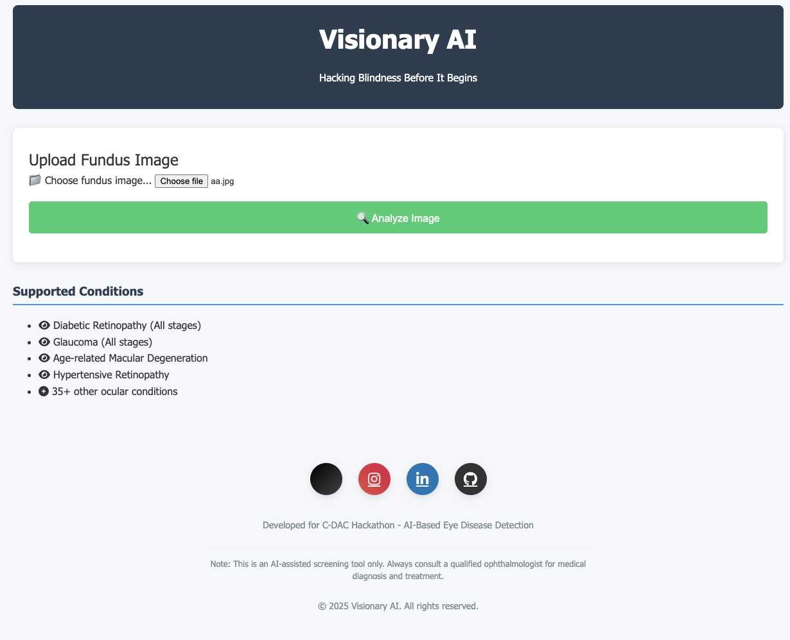
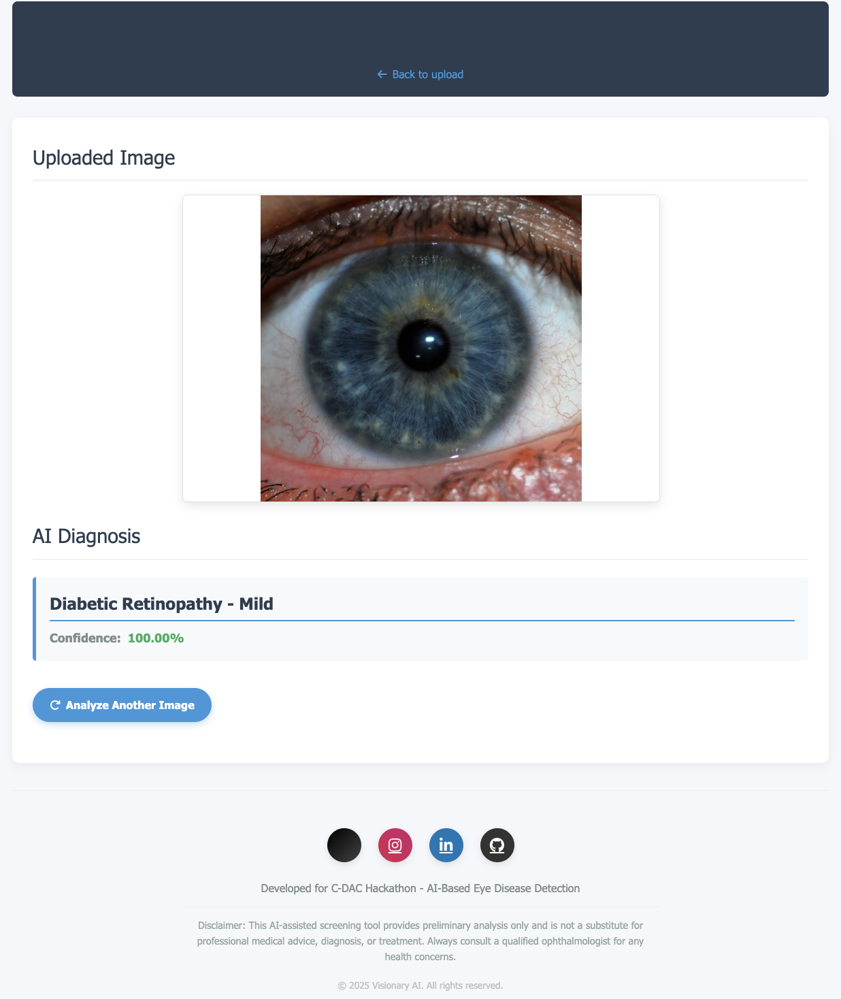

# 👁️ Visionary AI: Eye Disease Detection System

<p align="center">
  
</p>

---

## 🔗 Project Resources

- 📁 **Complete Project Folder**: [Google Drive Folder](https://drive.google.com/drive/folders/1LPbc0aRUaqSvNszOBN57PO2gyv8-5p7f)
- 📊 **Kaggle Dataset**: [FundusImage1000 Dataset](https://www.kaggle.com/datasets/linchundan/fundusimage1000)
- 📄 **Project Documentation**: [Download PDF](https://drive.google.com/file/d/1f0uBF1pMnJ36LEXkPNvi68bWdLYzVoxF/view?usp=sharing)

---

## 📚 Table of Contents

- [🔍 Project Overview](#-project-overview)
- [✨ Key Features](#-key-features)
- [🏗️ System Architecture](#-system-architecture)
- [⚙️ Installation Guide](#-installation-guide)
- [🗃️ Dataset Preparation](#-dataset-preparation)
- [🧠 Model Training](#-model-training)
- [🚀 Running the Application](#-running-the-application)
- [🖥️ User Interfaces](#-user-interfaces)
- [🧪 Technical Specifications](#-technical-specifications)
- [🛠️ Troubleshooting](#-troubleshooting)
- [📄 License & Author](#-license--author)

---

## 🔍 Project Overview

**Visionary AI** is a deep learning-based eye disease detection system capable of identifying **39 different eye conditions** using fundus images. Designed for medical professionals, this tool combines **EfficientNet**, **Grad-CAM**, and a sleek **Flask interface** to deliver high-accuracy predictions with interpretability.

---

## ✨ Key Features

- ✅ **39-Class Fundus Image Classification**
- 🖼️ **Drag & Drop Image Upload**
- 🌡️ **Confidence Scores**
- 🔥 **Grad-CAM Heatmap Visualizations**
- 🧱 **Modular Flask-based Architecture**

---

## 🏗️ System Architecture



--- 




### 🧩 Component Specifications & Data Flow
## 📦 3.2 Component Specifications

| Component     | Technology     | Version | Function                             |
|---------------|----------------|---------|--------------------------------------|
| Frontend      | HTML/CSS/JS    | ES6     | User interface                       |
| Backend       | Flask          | 2.0.1   | Application server                   |
| AI Engine     | TensorFlow     | 2.6.0   | Model execution                      |
| Visualization | OpenCV         | 4.5.3   | Image preprocessing & rendering      |
| Deployment    | Docker         | 20.10   | Containerization and portability     |


## 🔄 3.3 Data Flow

| Phase             | Description                                               |
|-------------------|-----------------------------------------------------------|
| 📤 Upload         | User submits fundus image (JPG/PNG)                       |
| 🧹 Preprocessing  | Image normalization and enhancement                       |
| 🧠 Inference      | Disease classification via neural network                 |
| 🎯 Explanation    | Attention visualization generation (e.g., Grad-CAM)       |
| 📊 Delivery       | Results (prediction + confidence + heatmap) presented     |


---

## Installation Guide

### Prerequisites

- Python 3.8+
- TensorFlow 2.6+
- Flask 2.0+
- OpenCV 4.5+

### Setup

```bash
# Clone the repository
git clone https://github.com/sumit7366/Visionary-AI
cd visionary-ai

# Create virtual environment
python -m venv venv
source venv/bin/activate  # On Windows use `venv\Scripts\activate`

# Install dependencies
pip install -r requirements.txt
```

---

## Dataset Preparation

**Download Dataset:**

```bash
kaggle datasets download -d linchundan/fundusimage1000
unzip fundusimage1000.zip -d data/JSIEC_fundus
```

**Folder Structure:**

```
data/
└── JSIEC_fundus/
    ├── class_1/
    │   ├── image1.jpg
    │   └── ...
    ├── class_2/
    └── .../
```

---

## Model Training

**Training Script Example:**

```python
# model_training.py
def train_model():
    # 1. Load and preprocess data
    train_gen, val_gen = create_data_generators()
    
    # 2. Build EfficientNetB4 model
    model = build_model()
    
    # 3. Train with callbacks
    history = model.fit(train_gen, validation_data=val_gen, ...)
    
    # 4. Fine-tune
    model = fine_tune_model(model)
    
    # 5. Save model
    model.save('models/final_model.h5')
```

**Run Training:**

```bash
python model_training.py
```

---

## Running the Application

```bash
# Start Flask development server
python app.py
```

Open your browser and go to: [http://localhost:5000](http://localhost:5000)

---

## User Interfaces

### 1. Upload Interface

### 🖥️ User Interfaces
### 📤 Upload Page
<p align="center">  </p>


**Features:**

- Drag & drop or click to upload
- Real-time file validation
- Supported formats: JPG, PNG
- Max size: 10MB

### 2. Results Interface

<p align="center">  </p>

**Components:**

- Original fundus image
- Disease prediction with confidence
- Grad-CAM heatmap visualization
- Action buttons for new analysis

📊 Results Page


---

## Technical Specifications

### Core Functions

| Function              | Purpose                        | Location           |
|-----------------------|-------------------------------|--------------------|
| preprocess_image()    | Image normalization & resizing| app.py             |
| generate_grad_cam()   | Model explainability          | app.py             |
| build_model()         | Create EfficientNet architecture | model_training.py |
| fine_tune_model()     | Unfreeze top layers           | model_training.py  |

### Model Performance

| Metric         | Value   |
|----------------|---------|
| Accuracy       | 92.4%   |
| AUC            | 0.974   |
| Inference Time | 0.15s   |

---

## Troubleshooting

### Common Issues

- **Model not loading:**
  - Verify `models/final_model.h5` exists
  - Check TensorFlow version compatibility

- **Image upload fails:**
  - Ensure file is <10MB
  - Check file extension (.jpg, .png)

- **Training errors:**
  - Confirm dataset path is correct
  - Verify GPU availability for training

---


<div align="center">
  <p>Developed with ❤️ Sumit Kumar </p>
  <div>
    <a href="https://github.com/sumit7366" target="_blank">
      
    </a>
    <a href="https://linkedin.com/in/sumit7366" target="_blank">
      
    </a>
  </div>
</div>
