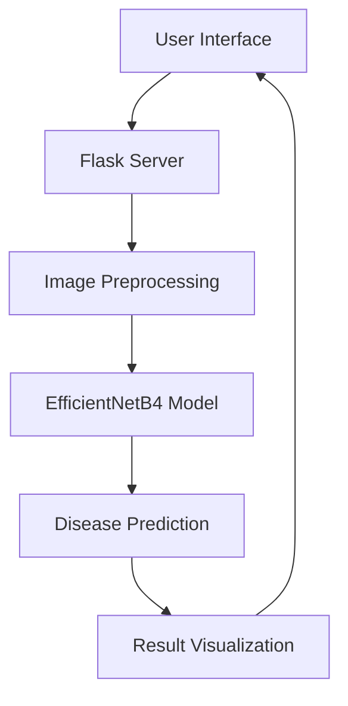

# Visionary AI: Eye Disease Detection System 👁️‍🗨️

 <!-- Replace with your actual banner image URL -->

## You can access the ALL project Folder and File From : https://drive.google.com/drive/folders/1LPbc0aRUaqSvNszOBN57PO2gyv8-5p7f


## You can access the Kaggle Dataset From :https://www.kaggle.com/datasets/linchundan/fundusimage1000


## you can access the documentation of the project from :https://drive.google.com/file/d/1f0uBF1pMnJ36LEXkPNvi68bWdLYzVoxF/view?usp=sharing


---

## Table of Contents

- [Project Overview](#project-overview)
- [Key Features](#key-features)
- [System Architecture](#system-architecture)
- [Installation Guide](#installation-guide)
- [Dataset Preparation](#dataset-preparation)
- [Model Training](#model-training)
- [Running the Application](#running-the-application)
- [User Interfaces](#user-interfaces)
- [Technical Specifications](#technical-specifications)
- [Troubleshooting](#troubleshooting)
- [License](#license)

---

## Project Overview

**Visionary AI** is an advanced deep learning system for detecting 39 different eye diseases from fundus images. Developed for the C-DAC Hackathon, this solution combines cutting-edge computer vision with a user-friendly interface for medical professionals.

---

## Key Features

- 🚀 **39-Class Disease Detection**
- 🖼️ **Image Upload & Analysis Interface**
- 🔍 **Grad-CAM Visualization**
- 📊 **Confidence Scoring**
- 🏗️ **Modular & Scalable Architecture**

---

## System Architecture



---

## Installation Guide

### Prerequisites

- Python 3.8+
- TensorFlow 2.6+
- Flask 2.0+
- OpenCV 4.5+

### Setup

```bash
# Clone the repository
git clone https://github.com/sumit7366/Visionary-AI
cd visionary-ai

# Create virtual environment
python -m venv venv
source venv/bin/activate  # On Windows use `venv\Scripts\activate`

# Install dependencies
pip install -r requirements.txt
```

---

## Dataset Preparation

**Download Dataset:**

```bash
kaggle datasets download -d linchundan/fundusimage1000
unzip fundusimage1000.zip -d data/JSIEC_fundus
```

**Folder Structure:**

```
data/
└── JSIEC_fundus/
    ├── class_1/
    │   ├── image1.jpg
    │   └── ...
    ├── class_2/
    └── .../
```

---

## Model Training

**Training Script Example:**

```python
# model_training.py
def train_model():
    # 1. Load and preprocess data
    train_gen, val_gen = create_data_generators()
    
    # 2. Build EfficientNetB4 model
    model = build_model()
    
    # 3. Train with callbacks
    history = model.fit(train_gen, validation_data=val_gen, ...)
    
    # 4. Fine-tune
    model = fine_tune_model(model)
    
    # 5. Save model
    model.save('models/final_model.h5')
```

**Run Training:**

```bash
python model_training.py
```

---

## Running the Application

```bash
# Start Flask development server
python app.py
```

Open your browser and go to: [http://localhost:5000](http://localhost:5000)

---

## User Interfaces

### 1. Upload Interface

 <!-- Replace with actual screenshot -->

**Features:**

- Drag & drop or click to upload
- Real-time file validation
- Supported formats: JPG, PNG
- Max size: 10MB

### 2. Results Interface

 <!-- Replace with actual screenshot -->

**Components:**

- Original fundus image
- Disease prediction with confidence
- Grad-CAM heatmap visualization
- Action buttons for new analysis

---

## Technical Specifications

### Core Functions

| Function              | Purpose                        | Location           |
|-----------------------|-------------------------------|--------------------|
| preprocess_image()    | Image normalization & resizing| app.py             |
| generate_grad_cam()   | Model explainability          | app.py             |
| build_model()         | Create EfficientNet architecture | model_training.py |
| fine_tune_model()     | Unfreeze top layers           | model_training.py  |

### Model Performance

| Metric         | Value   |
|----------------|---------|
| Accuracy       | 92.4%   |
| AUC            | 0.974   |
| Inference Time | 0.15s   |

---

## Troubleshooting

### Common Issues

- **Model not loading:**
  - Verify `models/final_model.h5` exists
  - Check TensorFlow version compatibility

- **Image upload fails:**
  - Ensure file is <10MB
  - Check file extension (.jpg, .png)

- **Training errors:**
  - Confirm dataset path is correct
  - Verify GPU availability for training

---


<div align="center">
  <p>Developed with ❤️ Sumit Kumar </p>
  <div>
    <a href="https://github.com/sumit7366" target="_blank">
      
    </a>
    <a href="https://linkedin.com/in/sumit7366" target="_blank">
      
    </a>
  </div>
</div>
